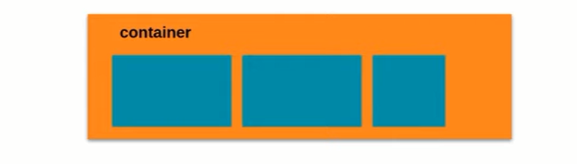

 # Introdução ao Flexbox

## Objetivos da aula:
 1. Conhecer a estrutura básica
 2. Entender a diferença entre Flex Container e Flex Item
 3. Conhecer inicialmente algumas propriedades

Foi projetado como um modelo de layout unidimensional e como um método que pode oferecer distribuição de espaço entre itens em uma interface e recursos de alinhamento.

### Flex Container
É uma tag que envolve os itens, será nela que iremos aplicar a propriedade "display: flex". Transforma todos os seus itens filhos em flex itens.

&nbsp;


**Vale ressaltar que essa inicialização de container pode ser feita em qualquer tipo de tag: ```<h1>, <h2>, <p>, <a>```ou até mesmo ``<div>``, a partir do momento em que essa tag possui filhos é passível de ser aplicado o display fex.**

#### Propriedades relacionandas: 
  
  * display -> Iniciador do container
  * flex-direction -> ele vai fazer o direcionameto desse container seja em linha ou coluna
  * flex-wrap -> vai se aplicar para quebra de linha ou não
  * flex-flow -> É uma abreviação para o direct e o wrap
  * justify-content -> Que alinha os items do conteiner de acordo com a sua direção.
  * align-items -> Alinhar os items de acordo com seu eixo no container
  * align-content -> Alinha as linihas deste container

### Flex Item
São elementos filhos diretos do **Flex Container**. E tambémm podem se torna **Flex Container.**

#### Propriedades relacionadas:

* flex-grow -> Define o fator de crescimento
* flex-basis -> Define o tamanho inicial desse item antes da distribuição do espaço restante denro do **Container**
* flex-shrink -> Define a capacidade de redução 
* flex -> É uma abreviação das 3 citadas acima
* order -> Relacionando a ordem de distribuição e listagem desses Itens
* align-self -> Vai definir o alinhamento de um item específico desse nosso **Container** 

# Fundamentos do Flexbox - Parte 1 (Flex Container)

## Estrutura básica do ``display: flex``
Sugestões: 
Usando o vscode instale essas duas extensões para ajudar a visualização em tempo real das mudanças feitas no html.
* HTML Snippets
* Live HTML Previewer
  
### Objetivos da aula
1. Conhecer e aplicar a propriedade de inicialização do **flex container** 

#### ``Display: flex``;

Torna a tag um elemento do tipo flex container, e assim automaticamente todos os seus filhos diretos desta tag, tornam-se em flex items.

***Prática*** 
&nbsp;
## Posicionando elementos com Flexbox em css.
[Prática](./praticas-html/0-display-flex.html)


