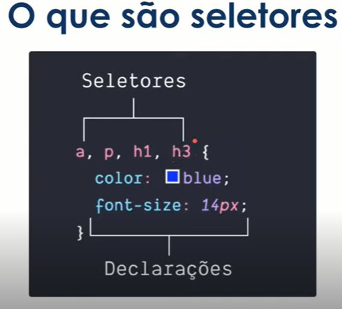
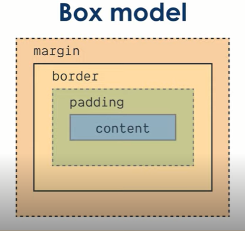

# Entendendo o que é semântica

## Semântica Part. 1

- 1.0 Semântica

```
    <section>
    <header
    <article>
    <aside>
    <footer>
    <h1> -- <h6>
```

- 1 section - Representa uma seção genérica de conteúdo, como uma lista de artigos, por exemplo.

- 2 header - Pode ser o cabeçalho de sua página ou de partes de sua página

- 3 article - Que representa um conteúdo relevante dentro de sua página ex: Artigo de um blog.

- 4 aside - Que representa um conteúdo relacionado ao conteúdo principal da página ex: biogradia de um autor, links relacionados, normalmente representado por uma barra lateral.

- 5 footer - Pode ser o rodapé de uma pagina ou partes de uma página Ex: Rodapé do article, rodapé de uma section.

- 6 h1 ao h6 - Eles representam a importância de um título dentro de uma página. H1 o título de sua página, o a o título de uma section, h3 o título de um artigo, e assim por diante. Uma regra que não podemos esquecer é que só pode ser usado um h1 por página.

## Semântica Part. 2

Exercício prático

# Como usar texto e links?

## Tags para textos

```
<h1>Título da página</h1>
<h2>Título de seção</h2>
<h3>Título da artigo</h3>

<p>Conteúdo de artigo</p>

```

O (P) - Representa um parágrafo, mas ele não suporta apenas textos, podemos adicionar, imagens, códigos, vídeos e vários outros tipos de conteúdo nele.

## Tags para links

```
<a>Link</a>
<a href="linkedin.com/in/jocksanbrito">Linkedin</a>
<a href="mailto:jocksan.brittos@gmail.com">E-mail</a>

<a target="_blank">Link</a>

```

(a) conhecindo como âncora.

- 1 href - É o hiperlink para onde a sua ancora está apontando
- 2 blank - Ele abre a aba em uma nova aba.

**Exercício prático** -> *Adicionando um texto fictício ao post do site.*

# Como inserir imagens em seu site

## Images

```
    
    </img>
    </img>
```

O SRC - é obrigatório e ele guarda o caminho da imagem, pode ser uma imagem dentro do próprio site ou até mesmo de um banco de imagem apenas com a url.

O Alt - é altamente recomendado para aumentar a acessibilidade, mostra para o usurário o que aquela imagem em questão significa.

**Exercício prático** -> *Adicionando uma imagem ao cabeçalho da página e a nossa postagem.*


# Como organizar listas com HTML
## Tags li,ul e ol

O elemento ``<ul>`` ***Unordery list***  representa uma lista em que a ordem dos itens não é importante.

O elemento ``<ol>`` ***Ordery list*** representa uma lista em que a ordem dos itens é importante.

O ``<li>`` ***Item list***  é usado para representar um item que faz parte de uma lista.

**Exercício prático** -> *Adicionando uma lista de contatos ao rodapé do site.*


# Introdução e conceitos básicos do CSS3
## Introdução ao CSS3
Definição: Criar regras de estilos para elementos ou grupo de elementos.

### O que são seletores:
  * Seletores <br>
    

*Seletores html (a, h1, h3 etc,) são apenas elementos html, dentro de um par de chaves temos apenas declarações, uma declaração é formada por uma propriedade e um valor ```color: blue``` *


### conceitos básicos:
  * Box Model <br>
        
*Margin: São os aspaçamentos entre os elementos*<br>
*Border: elas circundam o padding e o conteúdo. Conseguimos alterar a aparência delas como: Largura e Cor* <br>
*Padding: É o espaçamento entre a borda e o conteúdo*<br>
*Content: É o bloco que o seu conteúdo representa: Uma imagem, um texto, um vídeo e etc. *

* Principais seletores CSS
  Div class:

  


# Estilizando elementos, textos e listas
## Objetivos:


